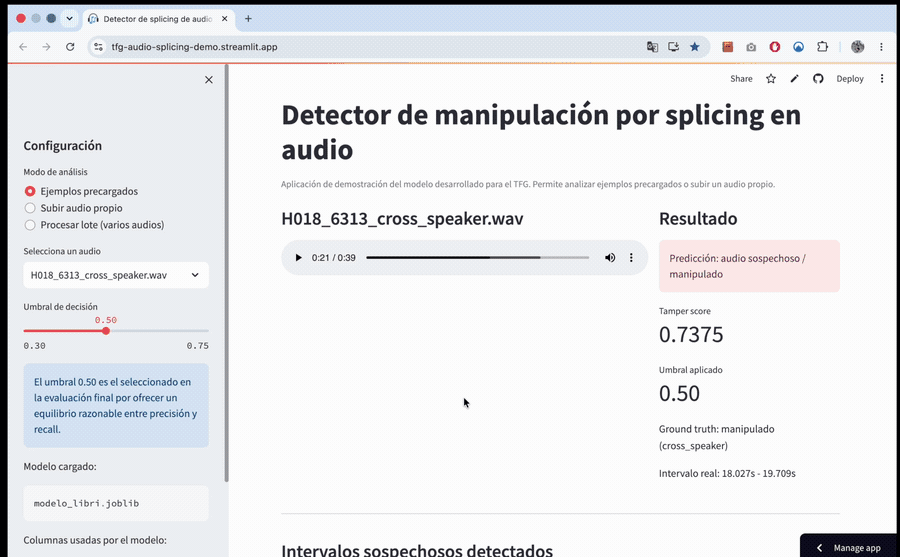
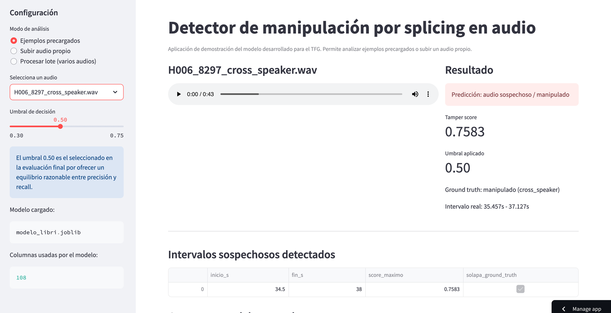
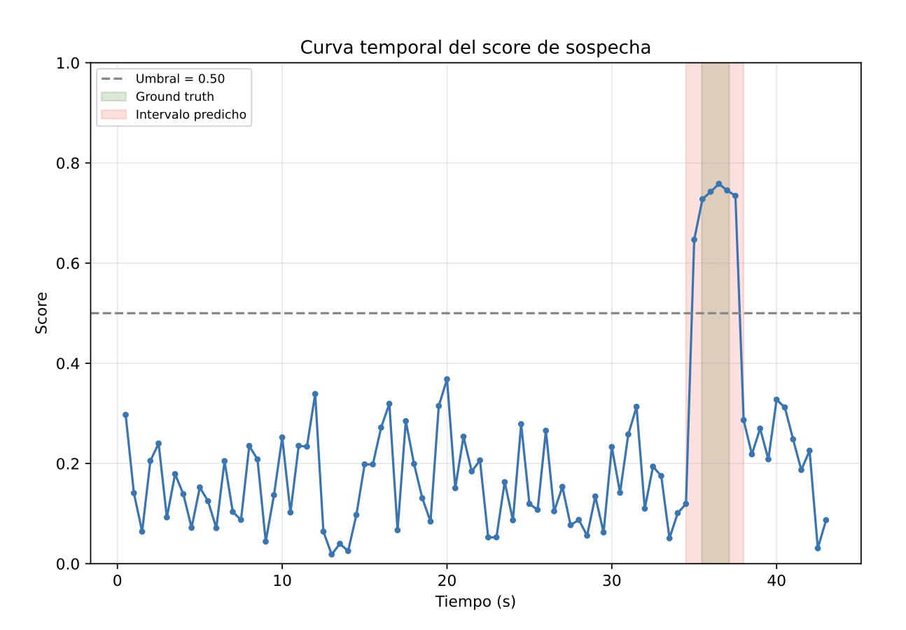
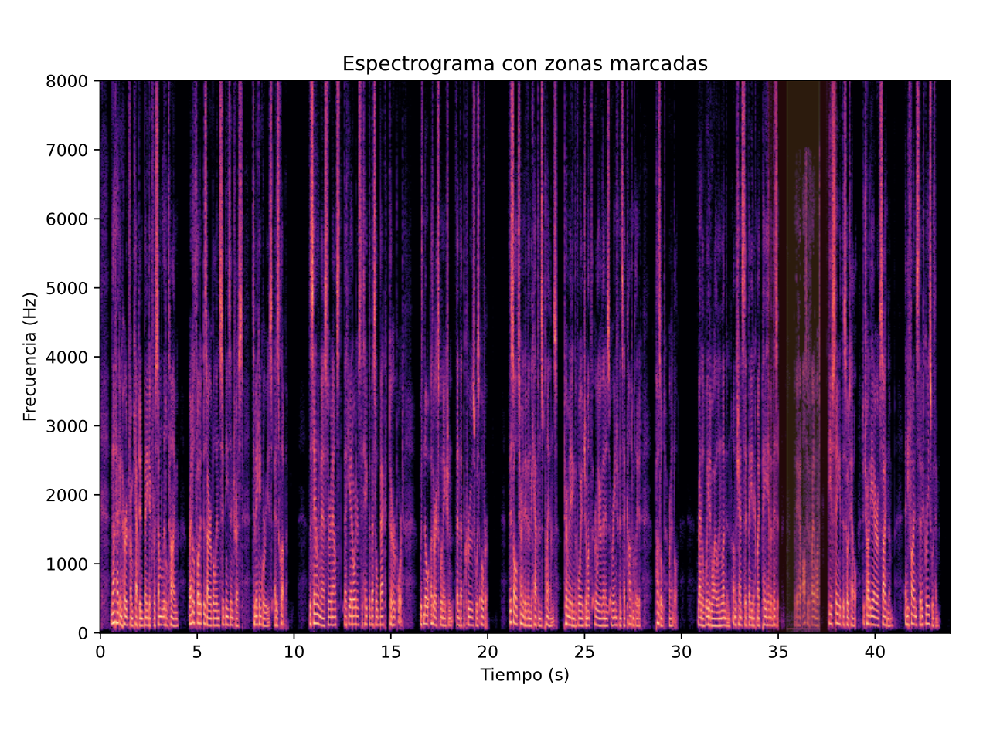
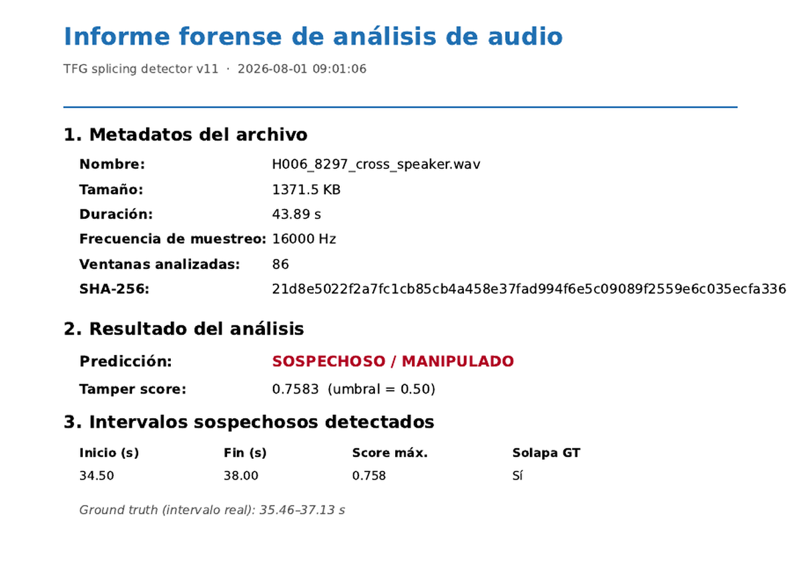
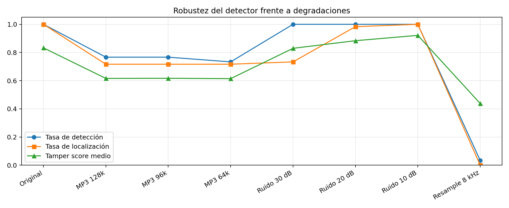

<div align="center">

# 🎙️ Detección forense de manipulaciones en audio con IA

**Detecta si una grabación de voz ha sido manipulada, señala en qué segundo, y genera un informe pericial con hash SHA-256.**

[](https://tfg-audio-splicing-demo.streamlit.app/)
[](https://www.python.org/)
[](https://scikit-learn.org/)
[](https://streamlit.io/)
[](LICENSE)

*Manipular un audio hoy lo puede hacer cualquiera. **Demostrar que no ha sido manipulado, no.***

</div>

---

## ⚡ En 30 segundos

Subes una grabación y el sistema te dice **si ha sido manipulada, dónde exactamente y con qué nivel de confianza** — y te lo entrega como documento verificable.

| | Audio limpio | Audio manipulado |
|---|---|---|
| **Predicción** | 🟢 Audio limpio | 🔴 Sospechoso / manipulado |
| **Tamper score** | **0.3683** | **0.7583** |
| **Intervalo detectado** | — | **34.5 s – 38.0 s** |
| **Intervalo real** *(ground truth)* | — | 35.46 s – 37.13 s ✅ |

<div align="center">

<br><sub><i>Análisis real de un audio manipulado: el pico de sospecha cae justo sobre el empalme.</i></sub>
</div>

---

## 🎯 Para qué sirve

El *audio splicing* consiste en insertar un fragmento de voz en otra grabación para alterar su mensaje. Aparece en:

| Ámbito | Problema real |
|---|---|
| ⚖️ **Peritaje judicial** | Un audio aportado como prueba: ¿es íntegro? ¿qué segundos revisar? |
| 🏦 **Fraude e identidad** | Suplantación de voz en banca telefónica y verificación de clientes |
| 📰 **Medios y verificación** | Declaraciones editadas que cambian de sentido |
| 🔐 **Respuesta a incidentes** | Cribado rápido de grandes volúmenes de material |

**El objetivo no es sustituir al perito, sino decirle qué archivos y qué segundos mirar primero.**

---

## 🔍 La detección, en detalle

Así se ve el resultado completo de un análisis:

<div align="center">

</div>

El pico de sospecha aparece **exactamente sobre el empalme**. En verde el intervalo real; en rojo, el que predice el sistema:

<div align="center">

</div>

La misma zona, marcada sobre el espectrograma:

<div align="center">

</div>

> **La idea central:** lo que delata un empalme no es lo que suena, sino **el salto entre un fragmento y el siguiente**. Cambia el ruido de fondo, el timbre y la reverberación de la sala — aunque el oído no lo perciba.

---

## 📄 Informe pericial con cadena de custodia

Cada análisis genera un **PDF firmado con el hash SHA-256 del audio original**. Así la salida deja de ser una predicción y pasa a ser **un documento verificable**, incorporable a una cadena de custodia.

<div align="center">

</div>

Incluye metadatos del archivo, hash SHA-256, predicción, *tamper score*, intervalos detectados y aviso legal. Se acompaña de un **CSV con los resultados ventana a ventana**.

---

## 📊 Resultados

Validación con **GroupKFold por hablante**: el modelo se evalúa siempre con **voces que nunca ha visto**. Sin fuga de datos.

<div align="center">

| Métrica | Valor |
|:---|:---:|
| **ROC-AUC por archivo** | **0.722** |
| **PR-AUC** | **0.896** |
| Estabilidad entre semillas | 0.71 ± 0.02 |

</div>

**El detector se comporta exactamente como predecía la teoría:**

| Escenario | ROC-AUC | Lectura |
|:---|:---:|:---|
| 🟢 Fragmento de **otro entorno acústico** | **0.999** | Detección casi perfecta |
| 🟡 Fragmento de **otra voz**, mismo entorno | 0.634 | Discriminación moderada |
| 🔴 Fragmento del **mismo audio** | 0.534 | Azar — límite documentado del método |

**Localización temporal:** 38/90 en umbral operativo estricto · 78/90 en modo cribado.

---

## ⚙️ Cómo funciona

```
Audio ──► Normalización 16 kHz mono ──► Ventanas de 1 s (salto 0,5 s)
      ──► 108 características ──► Random Forest (500 árboles)
      ──► Curva de sospecha ──► Decisión e intervalos por archivo
```

| Etapa | Detalle |
|:---|:---|
| **Características** | **108 por ventana:** 36 descriptores (MFCC, ZCR, RMS, centroide espectral, ancho de banda, rolloff) + **72 deltas** respecto a la ventana anterior y posterior |
| **Modelo** | Random Forest de 500 árboles — **sin GPU**, elegido por rendir bien con pocos datos y ser interpretable |
| **Decisión** | Máximo de la curva por archivo · umbral 0.50 fijado con el **índice de Youden** |
| **Reproducibilidad** | Semilla fija (42), Makefile y tests |

**Las deltas concentran el 66 % de la importancia** del modelo — y permutación y SHAP coinciden. Es decir: el sistema decide por la razón correcta, la discontinuidad, no por el contenido del audio.

---

## 🧪 La parte que más me enseñó

Mi primera evaluación daba un **F1 de 0.84**. Buen número, mal medido.

De cada grabación base salían tres archivos casi idénticos. Al repartirlos entre entrenamiento y prueba, el modelo se examinaba con audios cuya grabación de origen ya conocía: **fuga de datos** que afectaba a **45 de los 63 archivos**.

<div align="center">

| | F1 por archivo |
|:---|:---:|
| In-sample *(con fuga)* | 0.84 ❌ |
| **Out-of-fold real** | **0.31** ✅ |

</div>

En lugar de ocultarlo, **documenté el fallo, corregí el protocolo de validación y usé el hallazgo** para confirmar la hipótesis de que los empalmes del mismo audio no son detectables con este método. A partir de ahí reorienté el trabajo al caso que sí se detecta y que además importa en un peritaje.

Es la principal aportación metodológica del proyecto.

---

## 🔬 Rigor de la evaluación

No es un único experimento con una métrica: el repositorio incluye **11 análisis independientes** (`analisis_avanzado/`).

| Análisis | Qué comprueba |
|:---|:---|
| **Validación cruzada agrupada** | GroupKFold por hablante — sin fuga de datos |
| **Ablación y baselines** | Qué aporta cada bloque de características frente a referencias |
| **Robustez** | Compresión MP3, ruido aditivo y remuestreo |
| **Explicabilidad** | Importancia por permutación **y** SHAP (coinciden) |
| **Multisemilla** | Estabilidad del resultado entre semillas |
| **Desglose cross-source** | Rendimiento según el origen del fragmento insertado |
| **IoU de localización** | Solape real entre intervalo predicho y ground truth |
| **Validación externa** | Nota de voz real en español, fuera del corpus |
| **Transferencia** | PartialSpoof (voz sintética) — límite documentado |

---

## 🛡️ Robustez

Probado frente a las degradaciones que aparecen en material real:

| Degradación | Resultado |
|:---|:---|
| **Compresión MP3** (128k / 96k / 64k) | ✅ Se mantiene (0.73 – 0.77) |
| **Ruido aditivo** (30 / 20 / 10 dB) | ✅ Robusto incluso a 10 dB |
| **Remuestreo a 8 kHz** (banda telefónica) | ❌ Colapsa — límite documentado |

<div align="center">

</div>

---

## 🚀 Instalación y uso

Requiere **Python 3.10 o superior**.

```bash
git clone https://github.com/AngelorumCSE/tfg-audio-splicing-demo.git
cd tfg-audio-splicing-demo
python3 -m pip install -r requirements.txt
python3 -m streamlit run app_tfg.py
```

**Tres modos de análisis:**

| Modo | Qué hace |
|:---|:---|
| 📁 **Ejemplos precargados** | Audios con *ground truth* conocido, para verificar el sistema |
| 🎵 **Audio propio** | Sube cualquier grabación y obtén predicción, intervalos e informe |
| 📊 **Procesamiento por lotes** | Tabla-resumen con predicción y *tamper score* de varios audios |

**Formatos:** WAV, FLAC y OGG recomendados. MP3 y M4A se convierten internamente a WAV mono 16 kHz con FFmpeg. La versión web limita a 20 MB y analiza los primeros 120 s.

---

## 📁 Estructura

```
app_tfg.py               Aplicación Streamlit (pipeline de inferencia comentado)
Makefile                 Orquestador del pipeline completo (make all)
requirements.txt         Dependencias con versiones fijadas

src/                     Generación del dataset, extracción de características,
                         etiquetado, entrenamiento y evaluación
analisis_avanzado/       11 scripts de análisis: validación cruzada, ablación,
                         robustez, explicabilidad (SHAP + permutación),
                         multisemilla, IoU de localización y transferencia
reconstruccion/          Reproducción del experimento cross-source (LibriSpeech)
tests/                   Tests del pipeline

data/demo/               Ejemplos precargados de la aplicación
data/libri/              Conjunto cross-source derivado de LibriSpeech
data/processed/          Características por ventana
data/manifests/          Manifiestos con ground truth temporal
models/                  Bundles entrenados (clasificador + columnas + umbral)
reports/                 Métricas, gráficos y capturas del experimento
```

### Reproducir el experimento completo

Todo el pipeline está orquestado con `make` y semilla fija, de extremo a extremo:

```bash
make all        # dataset → características → etiquetas → entrenamiento → evaluación
make test       # tests del pipeline
make app        # lanza la aplicación
make help       # todos los objetivos disponibles
```

El modelo se persiste con `joblib` como **bundle completo** (clasificador, columnas esperadas y umbral), de modo que la aplicación y el experimento usan exactamente la misma configuración. **No es una demo simulada:** carga el mismo modelo entrenado.

---

## 📚 Datos

| Conjunto | Volumen | Papel |
|:---|:---|:---|
| Grabaciones propias | 63 audios · 4 hablantes · 5.194 ventanas | Desarrollo y diagnóstico |
| **LibriSpeech** | 120 audios · 30 bases × 4 versiones · 9.289 ventanas | **Validación principal** — 10 voces reservadas solo para inserciones |
| Nota de voz real en español | 1 audio (con consentimiento) | Comprobar que el principio no depende del idioma |
| PartialSpoof | 496 audios | Límite del dominio: voz sintética, transferencia nula |

---

## ⚠️ Alcance y limitaciones

Este sistema es un **apoyo al cribado pericial, nunca un dictamen**. La decisión final siempre corresponde a una persona.

**Fuera del dominio:** empalmes del mismo audio, banda estrecha (8 kHz) y voz parcialmente sintética. Los datasets son de tamaño moderado y las manipulaciones se generaron de forma controlada.

**Líneas de trabajo futuras:** corpus reales con recalibración por dominio · detección *copy-move* mediante auto-similitud · recompresión y cambios de velocidad · comparación rigurosa con *deep learning* cuando haya datos suficientes.

---

<div align="center">

### Sobre el proyecto

Trabajo Fin de Grado en **Ingeniería Informática** — Universidad Internacional de La Rioja (UNIR), julio de 2026 · Calificación **9,0**

**Ángel Carlos Soler Encinas** · Directora: Josefina Guerrero García

Licencia [MIT](LICENSE)

[](https://tfg-audio-splicing-demo.streamlit.app/)

</div>
