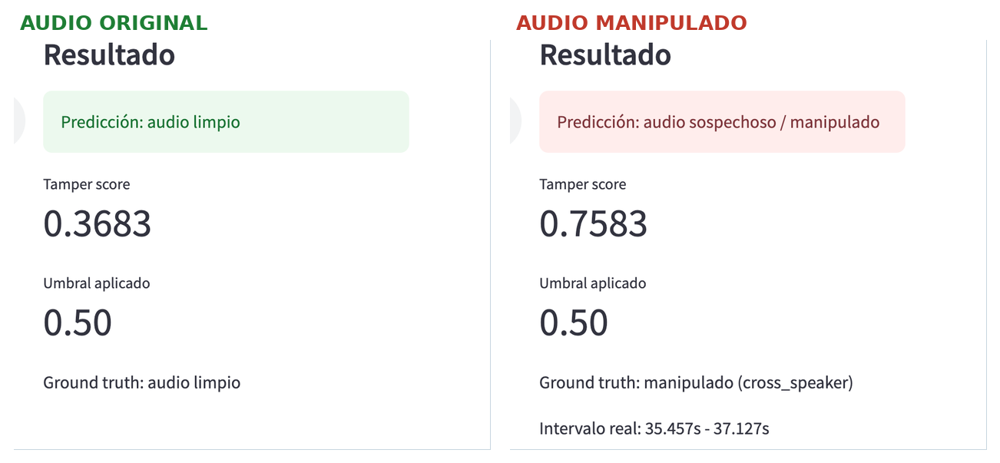
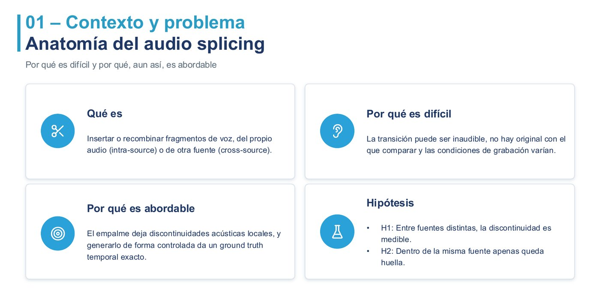
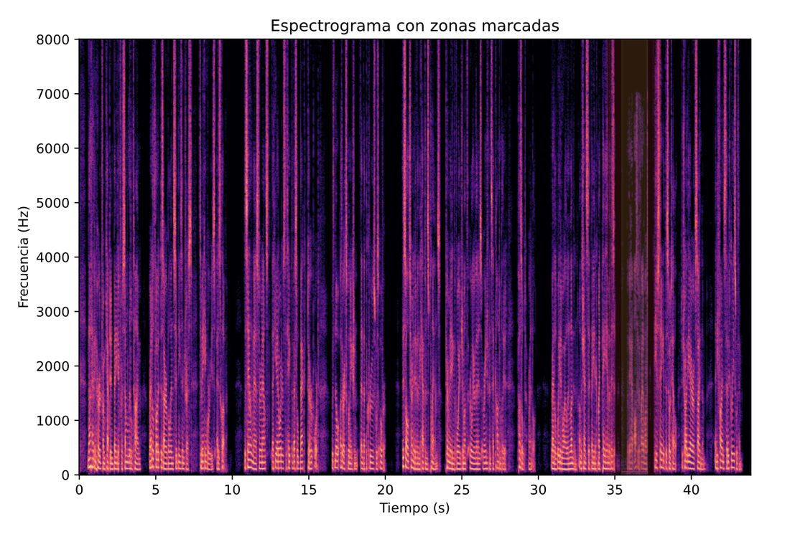
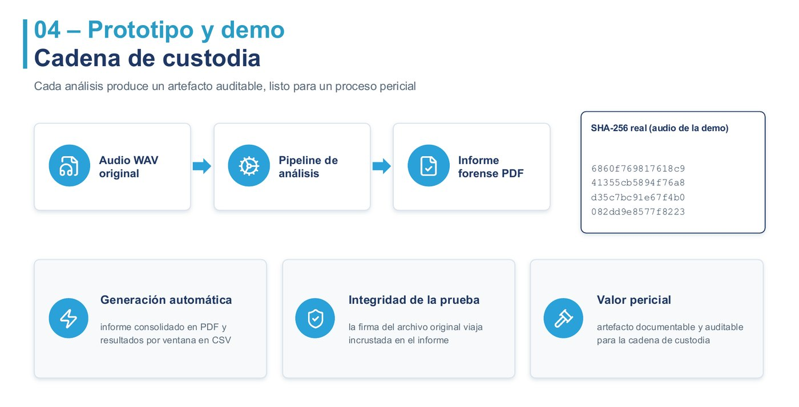
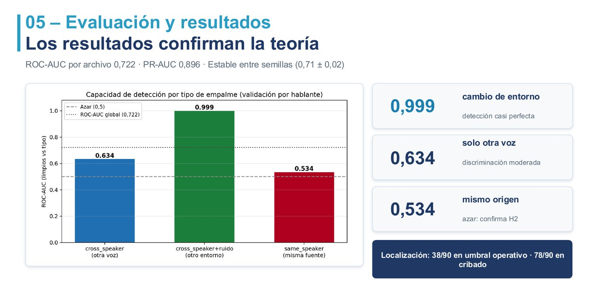
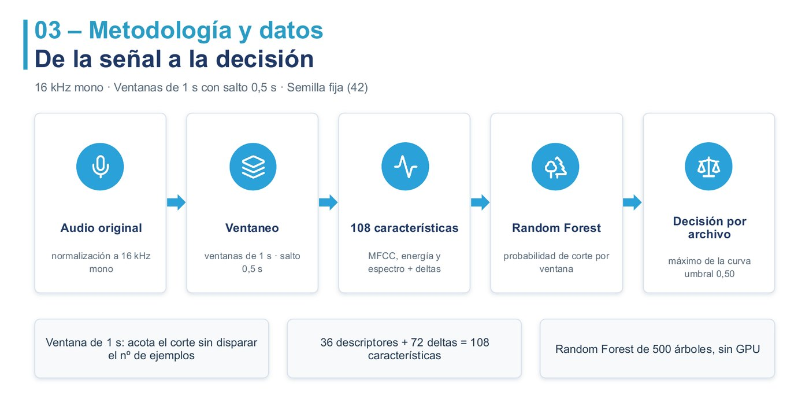
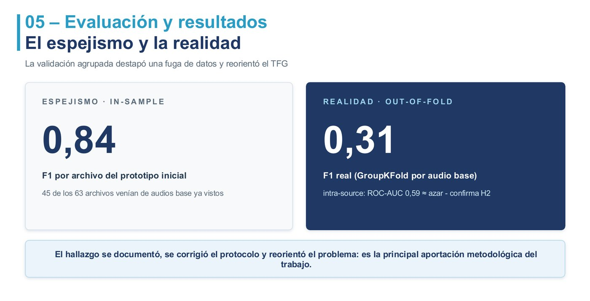
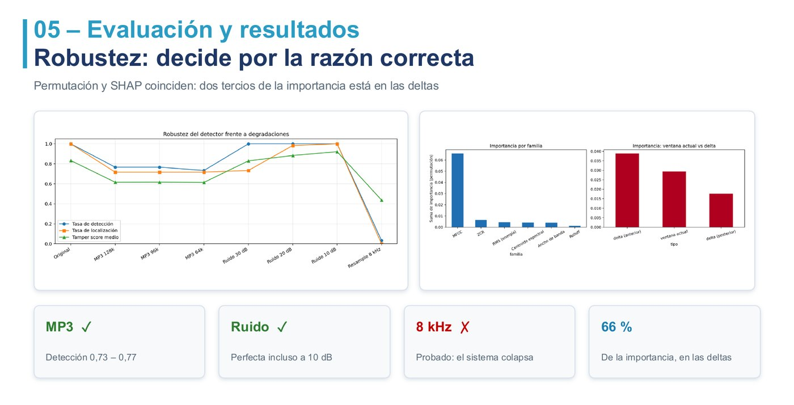
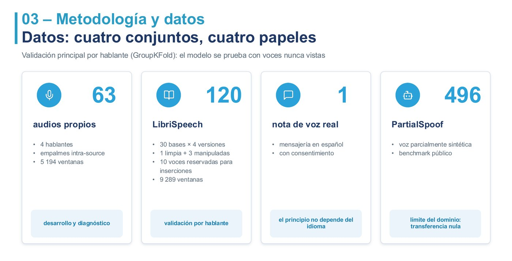
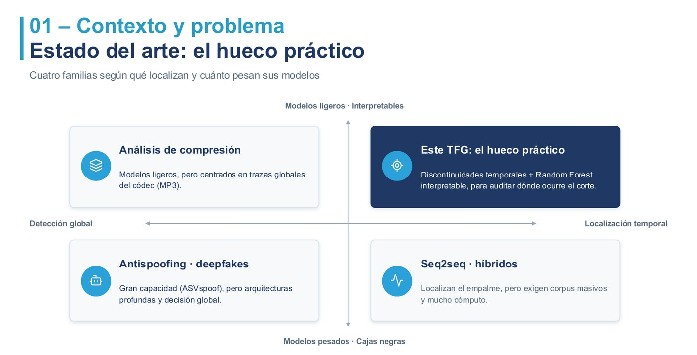

<div align="center">

# 🎙️ Detección forense de manipulaciones en audio con IA

**Detecta si una grabación de voz ha sido manipulada, señala en qué segundo, y genera un informe pericial con hash SHA-256.**

[](https://tfg-audio-splicing-demo.streamlit.app/)

[](https://www.python.org/)
[](https://scikit-learn.org/)
[](https://librosa.org/)
[](https://streamlit.io/)
[-informational?style=flat-square)](#-resultados)
[](LICENSE)

*Manipular un audio hoy lo puede hacer cualquiera. **Demostrar que no ha sido manipulado, no.***

</div>

---

## ⚡ En 30 segundos

Subes una grabación y el sistema te dice **si ha sido manipulada, dónde exactamente y con qué nivel de confianza** — y te lo entrega como documento verificable.

<div align="center">

</div>

<div align="center">
<sub>Y además <b>localiza el empalme</b>: intervalo detectado <b>34.5 s – 38.0 s</b> · intervalo real <b>35.46 s – 37.13 s</b> ✅</sub>
</div>

<div align="center">

<br><sub><i>Análisis real: el pico de sospecha cae justo sobre el empalme.</i></sub>
</div>

---

## 🎯 Para qué sirve

El *audio splicing* consiste en insertar un fragmento de voz en otra grabación para alterar su mensaje. Aparece en:

| Ámbito | Problema real |
|:---|:---|
| ⚖️ **Peritaje judicial** | Un audio aportado como prueba: ¿es íntegro? ¿qué segundos revisar? |
| 🏦 **Fraude e identidad** | Suplantación de voz en banca telefónica y verificación de clientes |
| 📰 **Medios y verificación** | Declaraciones editadas que cambian de sentido |
| 🔐 **Respuesta a incidentes** | Cribado rápido de grandes volúmenes de material |

> **El objetivo no es sustituir al perito, sino decirle qué archivos y qué segundos mirar primero.**

<div align="center">

</div>

---

## 🔍 La detección, en detalle

El pico de sospecha aparece **exactamente sobre el empalme**. En azul el intervalo real; en rojo, el que predice el sistema:

<div align="center">

</div>

La misma zona, marcada sobre el espectrograma:

<div align="center">

</div>

> **La idea central:** lo que delata un empalme no es lo que suena, sino **el salto entre un fragmento y el siguiente**. Cambia el ruido de fondo, el timbre y la reverberación de la sala — aunque el oído no lo perciba.

---

## 📄 Informe pericial con cadena de custodia

Cada análisis genera un **PDF firmado con el hash SHA-256 del audio original**. Así la salida deja de ser una predicción y pasa a ser **un documento verificable**, incorporable a una cadena de custodia.

<div align="center">

</div>

<div align="center">

</div>

Se acompaña de un **CSV con los resultados ventana a ventana**.

---

## 📊 Resultados

Validación con **GroupKFold por hablante**: el modelo se evalúa siempre con **voces que nunca ha visto**. Sin fuga de datos.

<div align="center">

| Métrica | Valor |
|:---|:---:|
| **ROC-AUC por archivo** | **0.722** |
| **PR-AUC** | **0.896** |
| Estabilidad entre semillas | 0.71 ± 0.02 |

</div>

**El detector se comporta exactamente como predecía la teoría:**

<div align="center">

</div>

Es decir: **detecta casi perfectamente cuando el fragmento viene de otro entorno acústico**, el caso que de verdad importa en un peritaje; y reconoce con honestidad que dentro del mismo audio no es detectable.

**Localización temporal:** 38/90 en umbral operativo estricto · 78/90 en modo cribado.

---

## ⚙️ Cómo funciona

<div align="center">

</div>

Los 36 descriptores por ventana son MFCC, ZCR, RMS, centroide espectral, ancho de banda y rolloff; las 72 deltas miden la diferencia con la ventana anterior y la posterior. El umbral de 0.50 se fijó con el **índice de Youden**, y el Random Forest se eligió por rendir bien con pocos datos **y ser interpretable**.

**Las deltas concentran el 66 % de la importancia** del modelo — y permutación y SHAP coinciden. Es decir: el sistema decide por la razón correcta, la discontinuidad, no por el contenido del audio.

---

## 🧪 La parte que más me enseñó

Mi primera evaluación daba un **F1 de 0.84**. Buen número, mal medido.

De cada grabación base salían tres archivos casi idénticos. Al repartirlos entre entrenamiento y prueba, el modelo se examinaba con audios cuya grabación de origen ya conocía: **fuga de datos** que afectaba a **45 de los 63 archivos**.

<div align="center">

</div>

En lugar de ocultarlo, **documenté el fallo, corregí el protocolo de validación y usé el hallazgo** para confirmar la hipótesis de que los empalmes del mismo audio no son detectables con este método. A partir de ahí reorienté el trabajo al caso que sí se detecta y que además importa en un peritaje.

Es la principal aportación metodológica del proyecto.

---

## 🔬 Rigor de la evaluación

No es un único experimento con una métrica: el repositorio incluye **11 análisis independientes** (`analisis_avanzado/`).

| Análisis | Qué comprueba |
|:---|:---|
| **Validación cruzada agrupada** | GroupKFold por hablante — sin fuga de datos |
| **Ablación y baselines** | Qué aporta cada bloque de características frente a referencias |
| **Robustez** | Compresión MP3, ruido aditivo y remuestreo |
| **Explicabilidad** | Importancia por permutación **y** SHAP (coinciden) |
| **Multisemilla** | Estabilidad del resultado entre semillas |
| **Desglose cross-source** | Rendimiento según el origen del fragmento insertado |
| **IoU de localización** | Solape real entre intervalo predicho y ground truth |
| **Validación externa** | Nota de voz real en español, fuera del corpus |
| **Transferencia** | PartialSpoof (voz sintética) — límite documentado |

---

## 🛡️ Robustez

Probado frente a las degradaciones que aparecen en material real:

<div align="center">

</div>

Aguanta la compresión y el ruido, que es lo que se encuentra en material real. **Colapsa en banda telefónica (8 kHz)** — un límite que está medido y documentado, no escondido.

---

## 🚀 Instalación y uso

Requiere **Python 3.10 o superior**.

```bash
git clone https://github.com/AngelorumCSE/tfg-audio-splicing-demo.git
cd tfg-audio-splicing-demo
python3 -m pip install -r requirements.txt
python3 -m streamlit run app_tfg.py
```

**Tres modos de análisis:**

| Modo | Qué hace |
|:---|:---|
| 📁 **Ejemplos precargados** | Audios con *ground truth* conocido, para verificar el sistema |
| 🎵 **Audio propio** | Sube cualquier grabación y obtén predicción, intervalos e informe |
| 📊 **Procesamiento por lotes** | Tabla-resumen con predicción y *tamper score* de varios audios |

**Formatos:** WAV, FLAC y OGG recomendados. MP3 y M4A se convierten internamente a WAV mono 16 kHz con FFmpeg. La versión web limita a 20 MB y analiza los primeros 120 s.

---

## 📁 Estructura

```
app_tfg.py               Aplicación Streamlit (pipeline de inferencia comentado)
Makefile                 Orquestador del pipeline completo (make all)
requirements.txt         Dependencias con versiones fijadas

src/                     Generación del dataset, extracción de características,
                         etiquetado, entrenamiento y evaluación
analisis_avanzado/       11 scripts de análisis: validación cruzada, ablación,
                         robustez, explicabilidad (SHAP + permutación),
                         multisemilla, IoU de localización y transferencia
reconstruccion/          Reproducción del experimento cross-source (LibriSpeech)
tests/                   Tests del pipeline

data/demo/               Ejemplos precargados de la aplicación
data/libri/              Conjunto cross-source derivado de LibriSpeech
data/processed/          Características por ventana
data/manifests/          Manifiestos con ground truth temporal
models/                  Bundles entrenados (clasificador + columnas + umbral)
reports/                 Métricas, gráficos y capturas del experimento
```

### Reproducir el experimento completo

Todo el pipeline está orquestado con `make` y semilla fija, de extremo a extremo:

```bash
make all        # dataset → características → etiquetas → entrenamiento → evaluación
make test       # tests del pipeline
make app        # lanza la aplicación
make help       # todos los objetivos disponibles
```

El modelo se persiste con `joblib` como **bundle completo** (clasificador, columnas esperadas y umbral), de modo que la aplicación y el experimento usan exactamente la misma configuración. **No es una demo simulada:** carga el mismo modelo entrenado.

---

## 📚 Datos

<div align="center">

</div>

La validación principal se apoya en **LibriSpeech**, con **10 voces reservadas exclusivamente para las inserciones** y evaluación por hablante, de modo que el modelo nunca se examina con una voz que haya visto entrenando.

---

## 🗺️ Dónde encaja frente al estado del arte

<div align="center">

</div>

Las aproximaciones existentes o **detectan sin localizar**, o **localizan pero exigen corpus masivos y modelos pesados**. Este trabajo ocupa el hueco práctico: **localiza el empalme con un modelo ligero e interpretable**, auditable en un contexto pericial.

---

## ⚠️ Alcance y limitaciones

Este sistema es un **apoyo al cribado pericial, nunca un dictamen**. La decisión final siempre corresponde a una persona.

**Fuera del dominio:** empalmes del mismo audio, banda estrecha (8 kHz) y voz parcialmente sintética. Los datasets son de tamaño moderado y las manipulaciones se generaron de forma controlada.

**Líneas de trabajo futuras:** corpus reales con recalibración por dominio · detección *copy-move* mediante auto-similitud · recompresión y cambios de velocidad · comparación rigurosa con *deep learning* cuando haya datos suficientes.

---

<div align="center">

### Sobre el proyecto

Trabajo Fin de Grado en **Ingeniería Informática**<br>
Universidad Internacional de La Rioja (UNIR) · julio de 2026 · Calificación **9,0**

**Ángel Carlos Soler Encinas** · Directora: Josefina Guerrero García

Licencia [MIT](LICENSE)

<br>

[](https://tfg-audio-splicing-demo.streamlit.app/)

</div>
